* # 🎁 编译原理实验

  > ECNU 后端及编译器具体实现

  ### :bear:实现语言

  > JAVA

  ### :koala:已完成

  > - 👉 词法分析 + 分词符号表
  > - :boom: LL(1) 语法分析 + 恐慌模式错误恢复
  > - :star2: 四元式中间代码 + 符号表生成
  > - :sailboat: 语义分析解释器

  ### :dog:效果图

  > #### a) 基本的输入、输出界面；
  >
  > **1.** **输入**
  >
  > 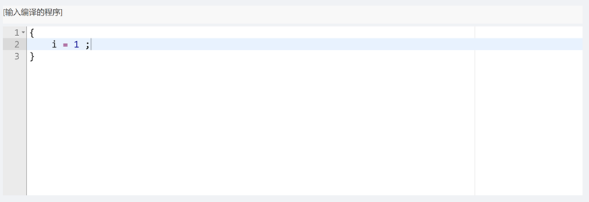
  >
  > **2.** **词法分析结果**
  >
  > 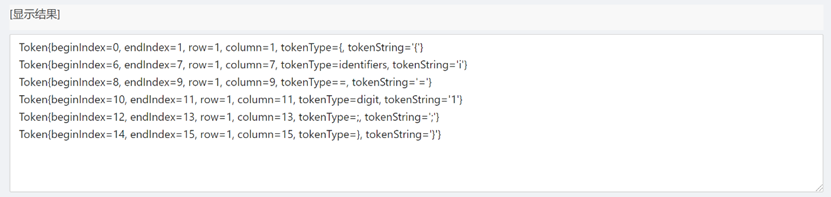
  >
  > **3.** **LL(1) FIRST 集**
  >
  > 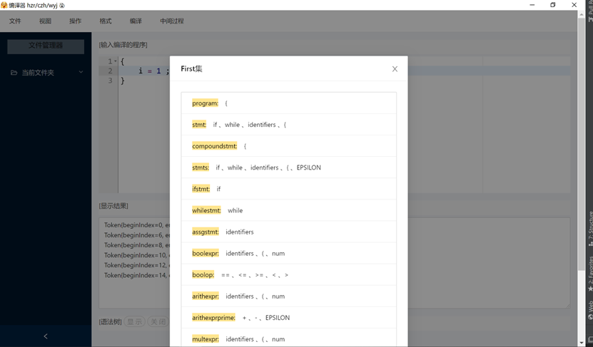
  >
  > **4.** **LL(1)Follow 集**
  >
  > 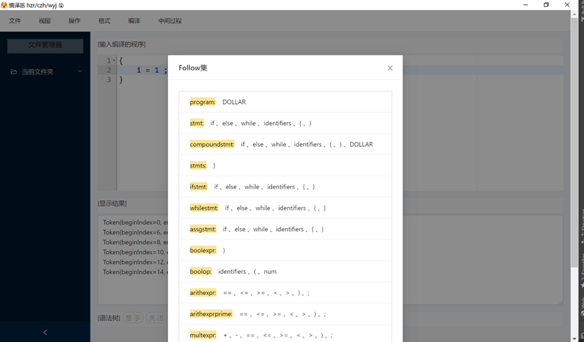
  >
  > **5.** **LL (1)解析表**
  >
  > 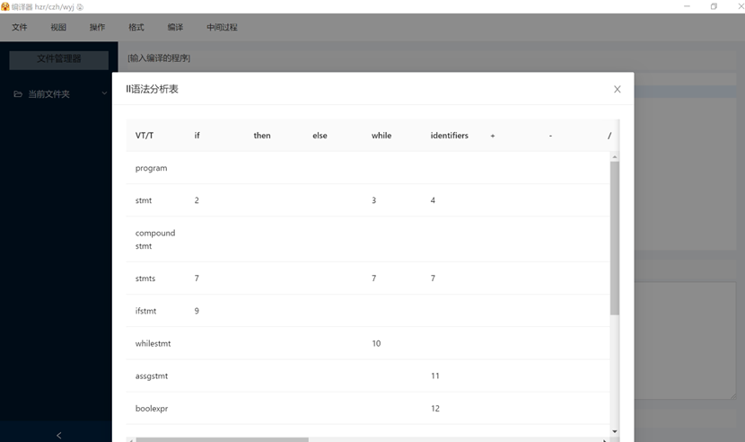
  >
  > **6.** **LL(1)** **生成的语法树**
  >
  > 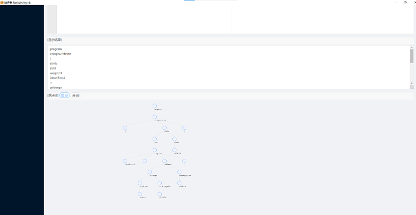
  >
  >  **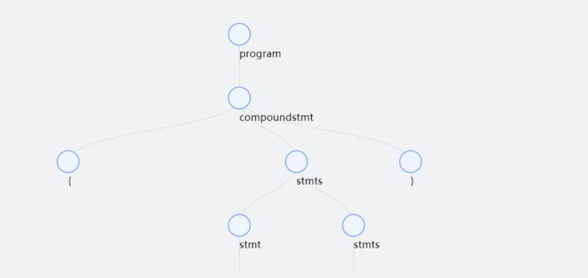**
  >
  > **7.** **错误提示（错误高亮** **和** **错误日志显示）**
  >
  > 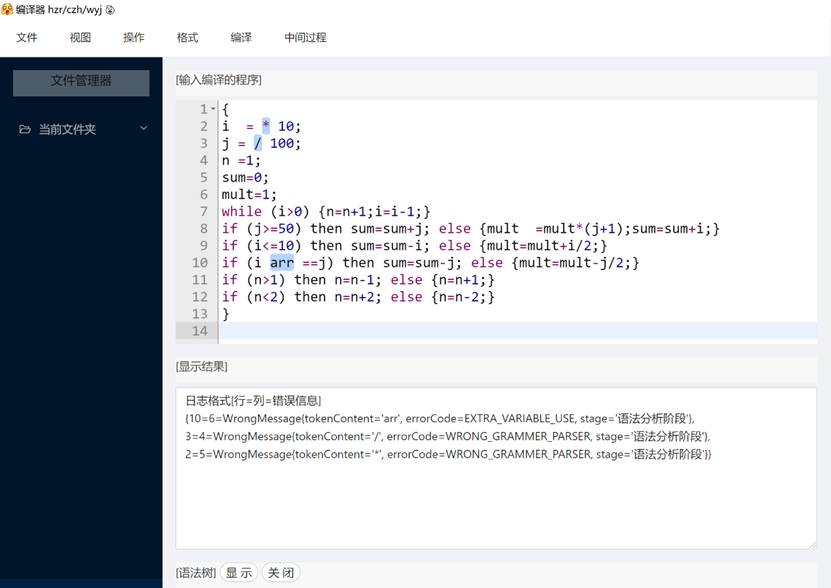
  >
  > **8.** **中间代码生成**
  >
  > 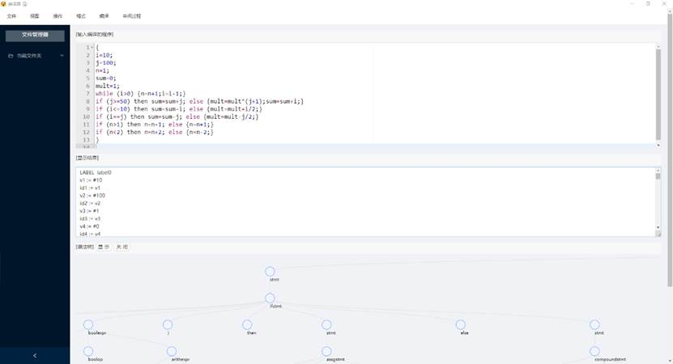
  >
  > **9.** **语义分析解释结果**
  >
  > 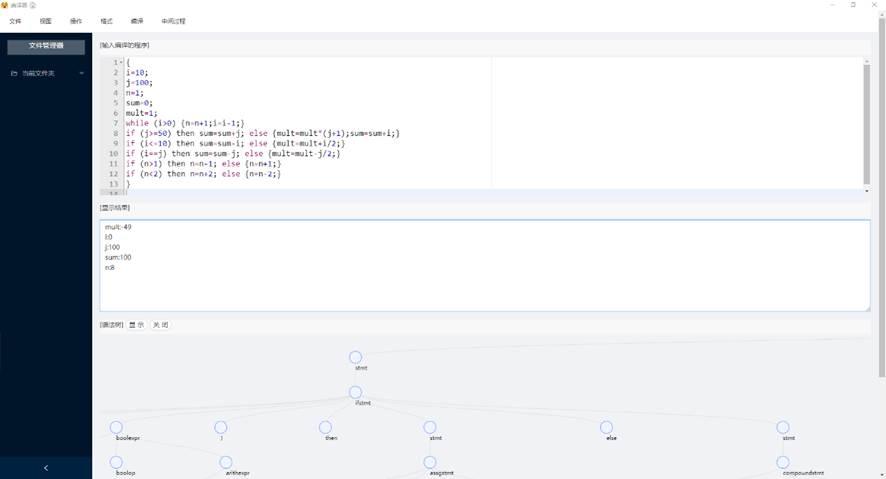
  >
  > **10. 自定义代码风格切换**
  >
  > 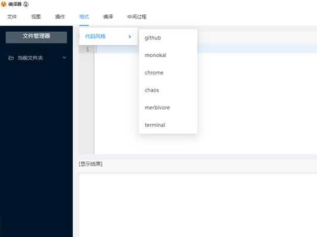
  >
  > 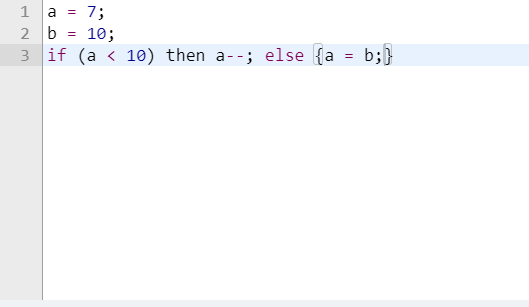
  >
  > 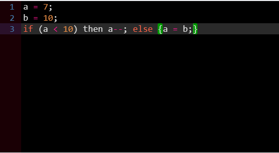
  >
  > 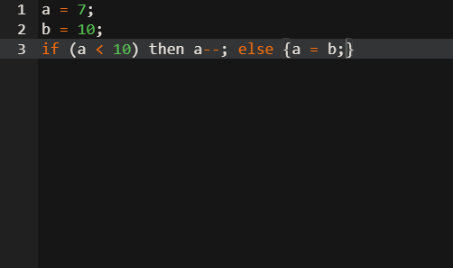
  >
  > 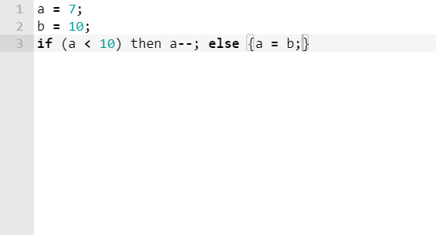
  >
  > #### b) 界面布局与设计
  >
  > 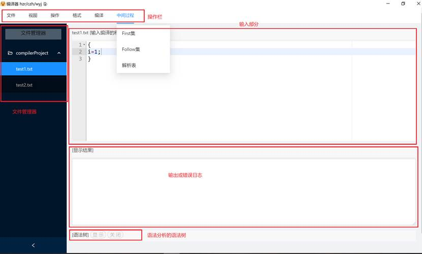

  ### :frog:运行说明

  > 1. git clone https://github.com/Wind-Gone/Toy-compiler-GUI 克隆本项目的前端库
  > 2. yarn 安装相关依赖包
  > 3. yarn start 启动 Electron
  > 4. git clone https://github.com/Wind-Gone/Toy-compiler 克隆项目后端编译器
  > 5. 启动 Springboot 即可运行

  ### :pouting_cat:项目目录

  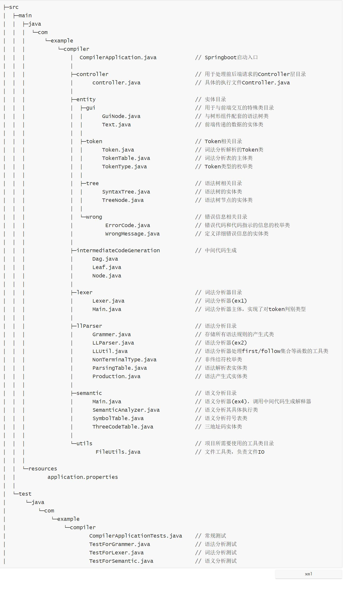

  ### :rabbit:特别鸣谢

  > :man_with_gua_pi_mao:@[caizhenghai](https://github.com/caizhenghai)
  >
  > :girl:@[Ling-WYJ](https://github.com/Ling-WYJ)
  >
  >  :man_with_turban:@[Wind-Gone](https://github.com/Wind-Gone)

