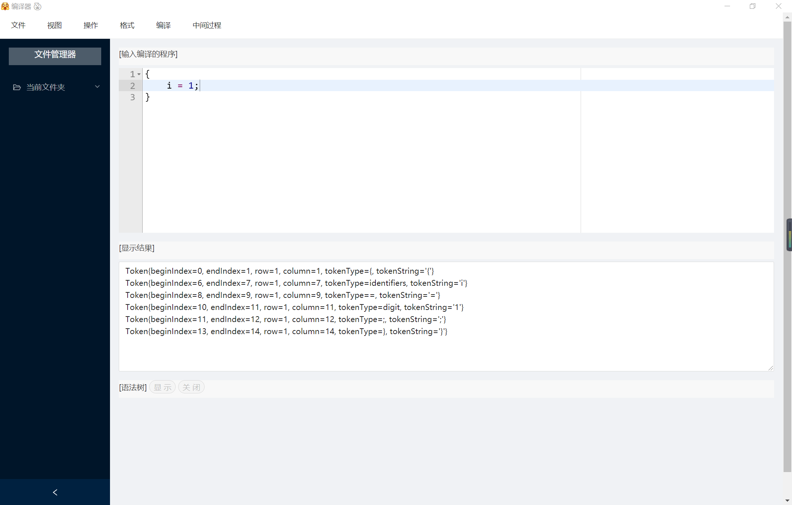
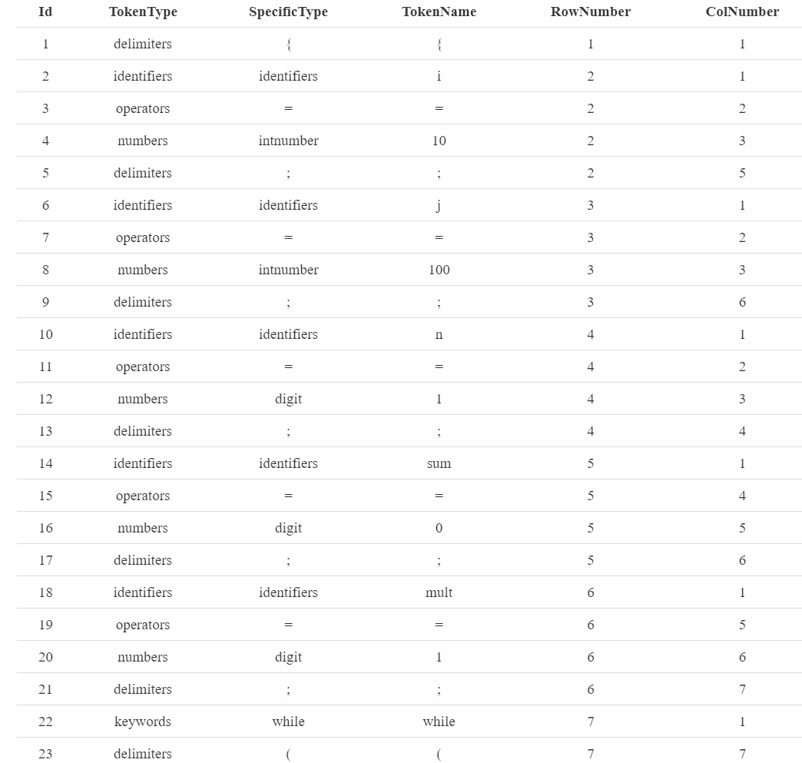
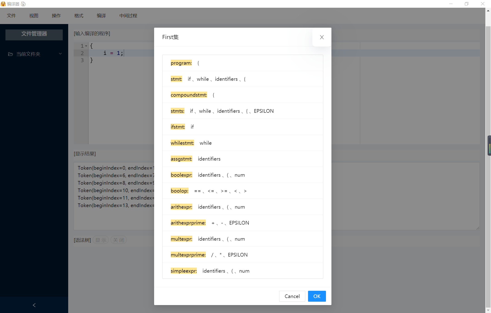
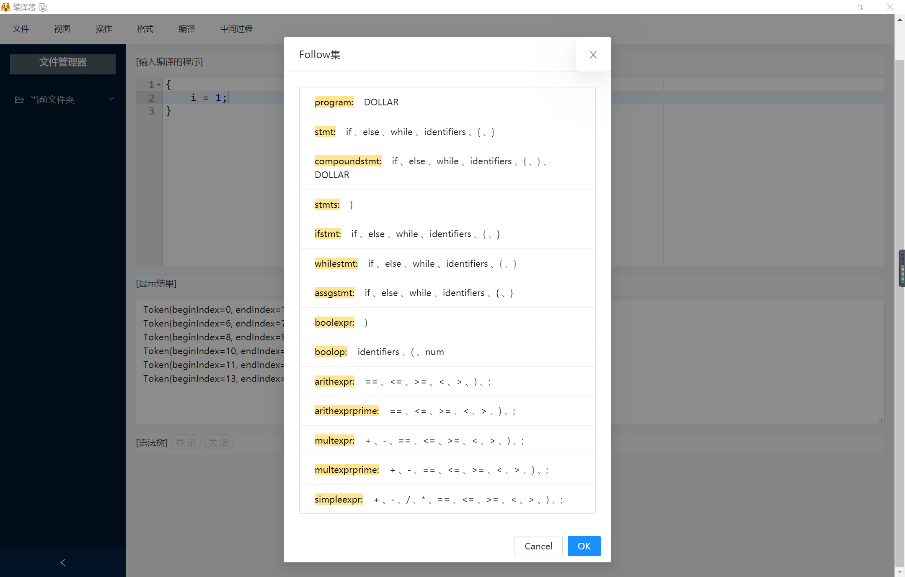
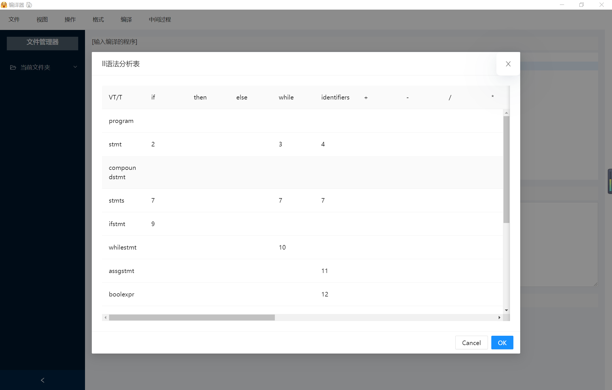
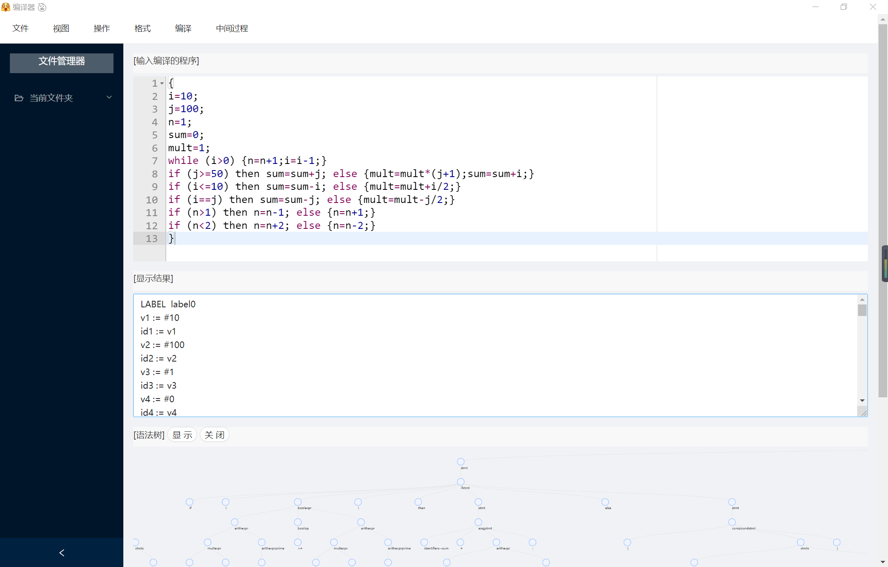
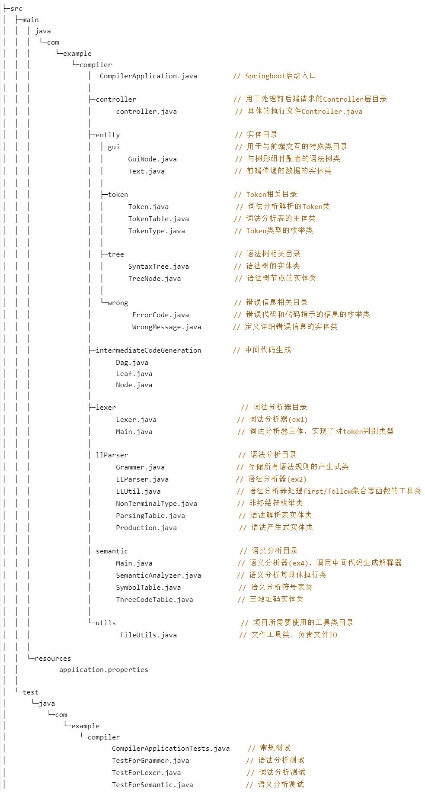

# 🎁 编译原理实验

> ECNU 后端及编译器具体实现  – 第六小组

### :bear:实现语言

> JAVA

### :koala:已完成

> - 👉 词法分析 + 分词符号表
> - :boom: LL(1) 语法分析 + 恐慌模式错误恢复
> - :star2: 四元式中间代码 + 符号表生成
> - :sailboat: 语义分析解释器

### :dog:效果图

> #### a) 基本的输入、输出界面；
>
> 
>
> **1.** **输入**
>
> 
>
> 
>
> 
>
> **2.** **词法分析结果**
>
> 
>
> 
>
> 
>
> 
>
> **3.** **LL(1) FIRST 集**
>
> 
>
> 
>
> 
>
> **4.** **LL(1)Follow 集**
>
> 
>
> 
>
> 
>
> **5.** **LL (1)解析表**
>
> 
>
> 
>
> 
>
> **6.** **LL(1)** **生成的语法树**
>
> 
>
> 
>
> ****
>
> 
>
> 
>
> **7.** **错误提示（错误高亮** **和** **错误日志显示）**
>
> 
>
> 
>
> 
>
> **8.** **中间代码生成**
>
> 
>
> 
>
> 
>
> **9.** **语义分析解释结果**
>
> 
>
> 
>
> 
>
> **10. 自定义代码风格切换**
>
> 
>
> 
>
> 
>
> 
>
> 
>
> 
>
> 
>
> #### b) 界面布局与设计
>
> 
>
> 

### :frog:运行说明

> 1. git clone https://github.com/Wind-Gone/Toy-compiler-GUI 克隆本项目的前端库
> 2. yarn 安装相关依赖包
> 3. yarn start 启动 Electron
> 4. git clone https://github.com/Wind-Gone/Toy-compiler 克隆项目后端编译器
> 5. 启动 Springboot 即可运行

### :pouting_cat:项目目录

### :rabbit:特别鸣谢

> :man_with_gua_pi_mao:@[caizhenghai](https://github.com/caizhenghai)
>
> :girl:@[Ling-WYJ](https://github.com/Ling-WYJ)

